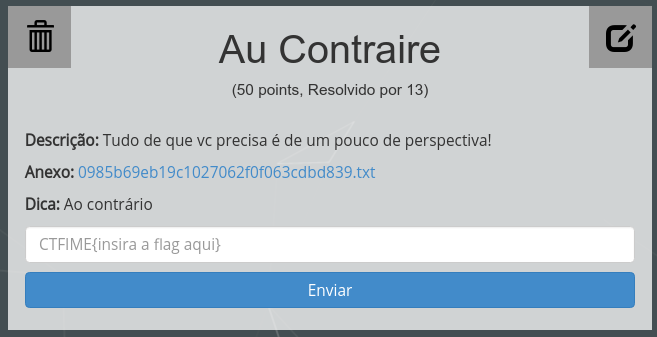

Essa provavelmente foi a questão mais fácil da competição e resolvida por praticamente todas as equipes.

O anexo nos dava um arquivo .txt contendo a string:

    50pm3t5050d0t3dl1c4f514mg4lf4r3s3v3d4ss3

À primeira vista poderia até ser algum hash, mas o título da questão dava a dica: Au Contraire. Assim, lendo a string de trás para frente poderíamos obter a flag. Para facilitar ainda mais e não corrermos o risco de esquecermos algum caractere, abrimos o interpretador Python (terminal + python) e invertemos rapidamente a string:

    '50p3t5050d0t3dl1c3v3d4ss3'[::-1]
    '3ss4d3v3s3r4fl4gm415f4c1ld3t0d0505t3mp05'

FLAG: *CTFIME{3ss4d3v3s3r4fl4gm415f4c1ld3t0d0505t3mp05}*
