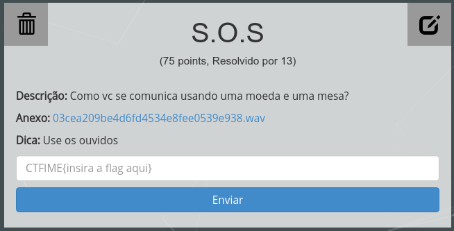
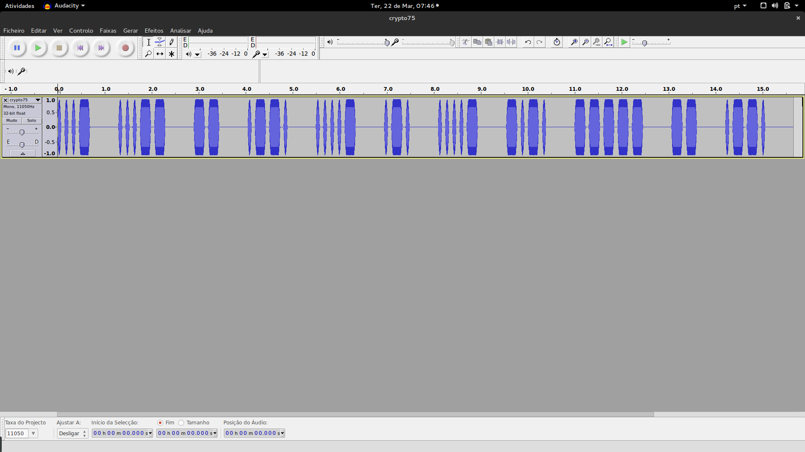

O texto e a dica não deixam dúvidas de que a mensagem se trata de um código Morse. Uma solução seria tentar decifrar a mensagem apenas ouvindo o áudio, mas um jeito mais interessante é abrir o arquivo anexo com o Audacity.

Com a ajuda da [tabela abaixo](https://upload.wikimedia.org/wikipedia/commons/thumb/b/b5/International_Morse_Code.svg/315px-International_Morse_Code.svg.png) é possível comparar os padrões visuais e esquecer o auditivo (mais difícil de reconhecer).

FLAG: *CTFIME{v3mpr4c0mp}*

